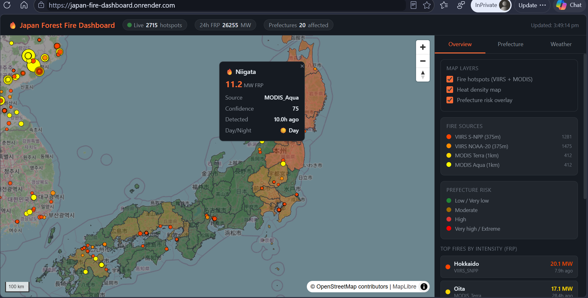
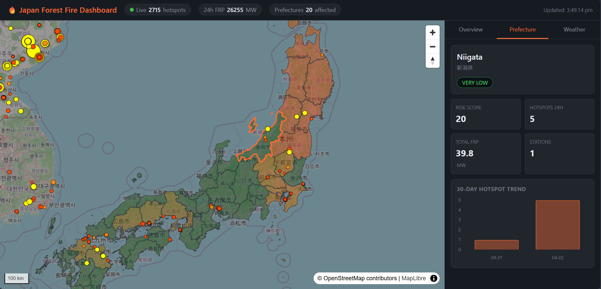
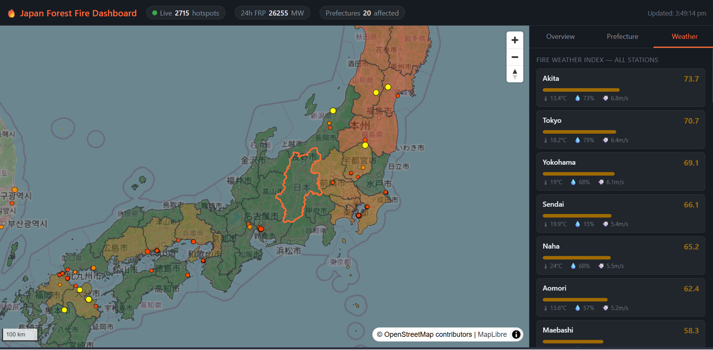

# Japan Forest Fire Dashboard — Near Real-Time

A production-grade, near-real-time forest fire monitoring dashboard for Japan.
Powered by NASA FIRMS, JMA weather, PostGIS, FastAPI, and MapLibre GL JS.

**Live demo:** https://japan-fire-dashboard.onrender.com

---
## Screenshots


*Live fire hotspots across Japan with prefecture risk overlay*


*Prefecture drill-down with 30-day hotspot trend and weather data*


*Fire Weather Index computed from temperature, humidity, and wind speed*

---

## Architecture

```
NASA FIRMS (hourly) ──┐
JAXA Himawari-9 ──────┤
JMA Weather ──────────┼──► APScheduler ──► PostGIS ──► FastAPI ──► MapLibre GL (browser)
Sentinel-2 (weekly) ──┘                                           auto-refreshes every 10 min
```

**Full stack:** Python · PostGIS · FastAPI · APScheduler · MapLibre GL JS
**Deployment:** Render.com (free tier) · share one URL

---

## Quick Start (Local)

### Prerequisites
- Docker Desktop
- Python 3.11+
- NASA FIRMS API key (free): https://firms.modaps.eosdis.nasa.gov/api/area/

### 1. Clone and configure
```bash
git clone https://github.com/your-username/japan-fire-dashboard
cd japan-fire-dashboard
cp .env.example .env
# Edit .env — add your FIRMS_API_KEY
```

### 2. Start PostGIS
```bash
docker compose up -d
# Wait ~10 seconds for PostGIS to be ready
docker compose ps   # confirm db is 'healthy'
```

### 3. Install Python dependencies
```bash
python -m venv venv
source venv/bin/activate      # Windows: venv\Scripts\activate
pip install -r requirements.txt
```

### 4. Initialise the database
```bash
python -m db.setup
```

This will:
- Create all tables, views, and functions
- Download Japan prefecture boundaries from GSI
- Run verification checks

Expected output:
```
08:00:00  INFO     Applying schema.sql …
08:00:02  INFO     Schema applied successfully
08:00:02  INFO     Downloading prefecture boundaries …
08:00:04  INFO     Loaded 47 prefecture boundaries
08:00:04  INFO     OK     PostGIS version         → 3.4.2
08:00:04  INFO     OK     Prefecture count        → 47
08:00:04  INFO     OK     Views exist             → 3
08:00:04  INFO     OK     Functions exist         → 2
08:00:04  INFO     Setup complete! Database is ready.
08:00:04  INFO     Next step: python -m ingest.firms
```

### 5. Run tests
```bash
pytest tests/test_schema.py -v
```

### 6. Fetch first fire data
```bash
python -m ingest.firms        # fetch last 24h of MODIS/VIIRS data for Japan
```

### 7. Start the API
```bash
uvicorn main:app --reload --port 8000
```

Open http://localhost:8000 — you'll see the live fire map.

---

## Database Schema

```
fire.prefecture_boundaries   ← Japan 47 prefectures (GSI official boundaries)
fire.fire_hotspots           ← Active fire detections (MODIS, VIIRS, Himawari-9)
fire.burn_scars              ← Burn area polygons from Sentinel-2 dNBR
fire.weather_observations    ← JMA weather stations (wind, RH, temperature)
fire.prefecture_risk_scores  ← Daily ML risk scores per prefecture
fire.ingestion_log           ← Pipeline run history and monitoring
```

Views: `v_recent_hotspots` · `v_daily_prefecture_summary` · `v_fire_clusters`

Functions: `get_hotspots_geojson()` · `get_risk_geojson()`

---

## Data Sources

| Source | Data | Update Freq | Access |
|--------|------|-------------|--------|
| NASA FIRMS | Active fire points (MODIS + VIIRS) | ~3 hour delay | Free API key |
| JAXA P-Tree | Himawari-9 wildfire product | 10 min | Free registration |
| JMA | Weather observations | Hourly | Open data |
| Copernicus | Sentinel-2 imagery | 5 day revisit | Free account |
| GSI | Prefecture boundaries, DEM | Static | Open data |

---


## About

**Ipshita Pradhan** — PhD in Remote Sensing, IIT Mandi  
Research experience: Ehime University (Japan) · Mitsubishi Electric Corporation  
Interests: Geospatial AI · Data Science · Earth Observation · Computer Vision · CAT Modelling

[](https://www.linkedin.com/in/ipshita-priyadarsini-pradhan/)
[](https://github.com/IpshitaPPradhan)
